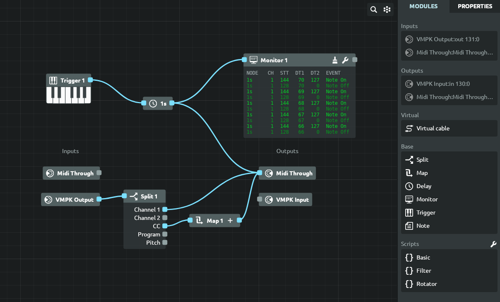

<h1 align="center">
  
   
  Mididash
   
</h1>

Mididash is an open source MIDI routing software with a node-based dashboard. A modern take on programs like [MIDI-OX](http://www.midiox.com).

  

### Features

  * **Cross-platform** available on Windows, Linux and macOS
  * **Node-based MIDI routing** allows for versatile configurations
  * **Hot-plugging** reconnect or replace MIDI devices
  * **MIDI monitoring** for inputs, outputs or individual nodes
  * **Pre-configured nodes** for MIDI splitting, mapping and more
  * **Script nodes** using Lua 5.4
  * **Lightweight** installer under 10MB
  * **High performance** built with Tauri and Rust

### Download

The latest version and others can be found on [Github releases]()

### Beta software

This software is under active development, the core features are ready but there may be changes in appearance, stability patches and other changes until version 1.0.

### How does it compare with MIDI-OX?

MIDI-OX is the main reference for this program, this one offers more routing capabilities and practical scripting via Lua nodes, it does not contain the same amount of MIDI tools like bank selectors or NPRN calculators but those can be added over time.

In terms of performance, it's about the same CPU usage (e.g. 5% CPU on high midi throughput), the bundle size is small but cannot compete with 2MB of MIDI-OX, the memory footprint of the program is also similar but the webview can consume a few  dozen MBs.

### Hot plugging

New devices or disconnected devices are detected every few seconds. To add a new device to the project simply drag and drop it from the sidebar into the viewport. To replace a missing device or a device with changed ID click its node (if it exists) and then `Replace device` from the sidebar - it will assign the device to that node and re-establish all previous connections.

### Scripts and templates

Using Lua 5.4 it's possible to program nodes for any kind midi processing. A few examples have been included to demonstrate how to modify and forward bytes. To test a script press `Ctrl+Enter` or `Cmd+Enter` from the code editor. Once a script is loaded into a node, it will run every time a signal is received on its input port.

Scripts can be saved as global templates to be reused in projects, to do so
click the settings icon near the code editor and then `Save as template`.

### Development

Make sure [tauri 2 requirements](https://v2.tauri.app/start/prerequisites/) are met for the target platform, hit `npm install` and then `npm start` should start the application in development mode.

### License

[GPL 3](https://www.gnu.org/licenses/gpl-3.0.en.html)